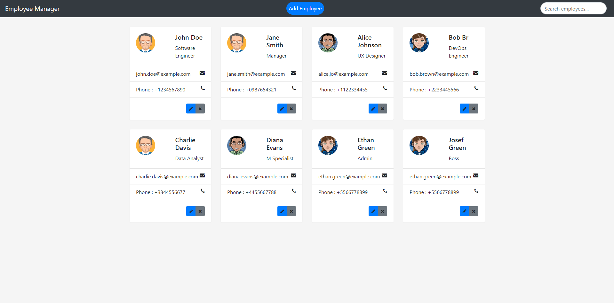

# Employee Management Frontend

## Overview
A frontend Angular application for managing employees. Features include viewing, adding, updating, and deleting employees.

## Features
- **View Employees**
- **Add Employee**
- **Update Employee**
- **Delete Employee**
- **Search Employees**

## Images


## Technologies
- **Angular 18**
- **Bootstrap 4.2.1**
- **Font Awesome 4.3.0**

## Backend Integration
This frontend application is designed to work with a Java REST API that you have implemented separately. Make sure the backend is running and accessible before using this application.

## Installation
1. **Clone the Repository**
    ```sh
    git clone https://github.com/eloom13/employee-management-frontend.git
    ```

2. **Install Dependencies**
    ```sh
    cd employee-management-frontend
    npm install
    ```

## Running the Application
Start the development server:
```sh
ng serve

